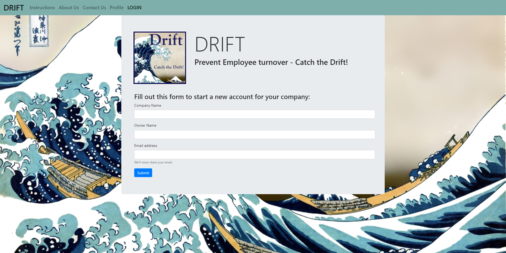

  

# Drift
* Prevent Employee Turnover. Catch their drift!

Link to the live website: (https://desolate-tor-70808.herokuapp.com/)

# Developers
* Sam Delay - https://github.com/sldelay
* Walter Hoerman - https://github.com/whoerman
* Tania Moore - https://github.com/TaniaGM
* Brian Lipsett - https://github.com/BLipsett

# Usage
* Employee turnover is an issue for many employers. It has a financial impact on the company and often an impact on employee as well. This app aims to help both parties in a pivotal aspect of success, communication.

# Installation 
* All necessary npm packages for this project to run are listed in the root package.json file. 

# Repository
* (Github Repo) https://github.com/sldelay/Drift

# Prerequisites
* This app is deployed to heroku here -->

# Built With
* [VSCode](https://code.visualstudio.com/) - Editor
* Javascript, jQuery, HTML, CSS, Handlebars, NodeJS, Express, MySql

# Future Development
* The scope of this project for small business is, ironically, big.
* Add graphing to start tracking employee satisfaction.
* Add historical data for employees and admins to reference back too.
* incentivize employee participation.

# Licensing
licensed under the MIT license.

